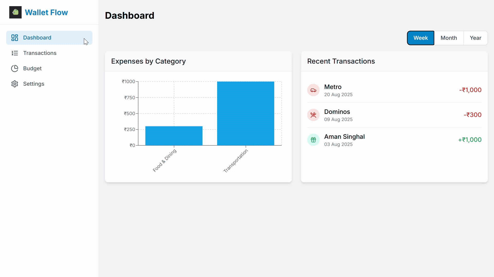

#  Wallet Flow  
  



 
 
 
 
  
<br>
  


> Feature-rich personal finance tracker including expense logging, category-based organization, and offline download support.
> Built with a responsive, interactive UI and integrated analytics helps in budgeting, savings goals, and spending insights.  

🔗 **Live Demo** → [wallet-flow](https://wallet-flow-sage.vercel.app/)  

<br>

---

## 🚀 Features  
- 📌 **Expense Tracking** – Add, edit, and delete transactions with ease  
- 🎨 **Modern UI** – Responsive design with Tailwind CSS  
- ✨ **Smooth Animations** – Powered by GSAP & Framer Motion  
- 📱 **Mobile-First** – Optimized for phones and tablets  
- 🌐 **Deployed on Vercel** for fast and reliable access  

---

## 🛠️ Tech Stack  
- **Frontend:** React.js, Tailwind CSS  
- **Animations:** GSAP, Framer Motion  
- **Version Control:** GitHub  
- **Deployment:** Vercel  

---

## 📂 Project Structure  
```bash
wallet-flow/
│── src/          # React components & pages
│   ├── assets/
│   ├── components/ # React components
│   ├── context/
│   ├── pages/
│   ├── App.css
│   ├── Index.css
│   ├── main.jsx
│   └── App.jsx    # Main app component
│── public/       # Static assets
│── package.json  # Dependencies
│── package-lock.json
│── index.html
│── vite.config.json
│── tailwind.config.json
│── postcss.config.json
│── README.md     # Documentation
```
<br>

---

## 📸 Screenshots

## Dashboard


## Transaction


## Budget


## Settings


---

## 🏁 Getting Started

Follow these steps to set up the project locally:

---

### 1️⃣ Clone the Repository and install dependencies
```bash
git clone https://github.com/ancure-2004/Wallet-Flow-Expense-Tracker.git
cd wallet-flow
npm install
npm run dev
```
---

## 🔮 Future Enhancements
- 📱 Mobile app version (React Native)
- ☁️ Cloud sync for transactions
- 📈 Analytics with charts and graphs
- 👥 Multi-user support for shared expenses
- 🔔 Notifications & reminders

---

## 🤝 Contributing
# We welcome contributions!
- Fork the repository
- Create a new branch (git checkout -b feature-name)
- Make your changes and commit (git commit -m 'Add feature')
- Push to the branch (git push origin feature-name)
- Open a Pull Request

---

## License

This project is licensed under the [MIT License](LICENSE).

### Contact
- 📧 ankur2004tyagi@gmail.com
- 🔗 www.linkedin.com/in/ankur-tyagi2004
